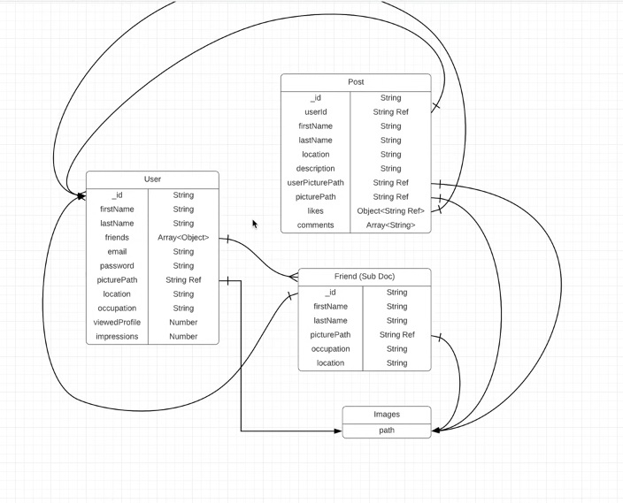

# Build a Fullstack MERN React Responsive Social Media Application from Scratch

    An alternative Social Media Application For the Family Unite with multuple features:
        - create a detailed profile
        - create posts
        - like and comment on posts
        - add friends
        - sand messages
        - and many more features

# I - Backend

## 1 - Backend Installation of Node, Visual Studio Code, and Backend Packages

### 1.1 - Nodemon

    nodemon is a tool that helps develop Node.js based applications by automatically restarting the node application when file changes in the directory are detected.

    ```
    npm install -g nodemon # or using yarn: yarn global add nodemon

    nodemon [your node app] # in this case it would be nodemon server/index.js
    ```

### 1.2 - Backend Packages

    - express
    - mongoose
    - bcrypt
    - jsonwebtoken
    - cors
    - morgan
    - dotenv
    - multer
    - multer-gridfs-storage
    - gridfs-stream
    - helmet

    ```
    npm install express mongoose bcrypt jsonwebtoken cors morgan dotenv multer multer-gridfs-storage gridfs-stream helmet
    ```

### 1.3 - initialize a Node.js project

    ```
    npm init -y
    ```

    - this will create a package.json file in the current directory
    - add "type": "module" to the package.json file to use import/export syntax instead of require/exports syntax:
        - exampele:
            ```
                import express from "express";
                vs
                const express = require("express");
            ```

### 1.4 - create the main index.js file

    ```
    touch index.js
    ```

## 2 - Backend Configurations and Middleware Setup

### 2.1 - import packages

    ```
    import express               from "express";
    import http                  from "http"
    import cors                  from "cors";
    import path                  from "path";
    import multer                from "multer";
    import helmet                from "helmet";
    import morgan                from "morgan";
    import mongoose              from "mongoose";
    import dotenv                from "dotenv";
    import bodyParser            from "body-parser";
    import { fileURLToPath }     from "url";
    import { Server }            from "socket.io";
    import { v2 as cloudinary }  from 'cloudinary';
    import { CloudinaryStorage } from "multer-storage-cloudinary";
    ```
### 2.2 - packages configuration

    - [express](https://github.com/expressjs/express)
    - [http](https://nodejs.org/api/http.html)
    - [cors](https://github.com/expressjs/cors)
    - [path](https://nodejs.org/api/path.html)
    - [multer](https://github.com/expressjs/multer)
    - [helmet](https://github.com/helmetjs/helmet)
    - [morgan](https://github.com/expressjs/morgan)
    - [mongoose](https://github.com/Automattic/mongoose)
    - [dotenv](https://github.com/motdotla/dotenv)
    - [bodyParser](https://github.com/expressjs/body-parser)
    - [fileURLToPath](https://nodejs.org/api/url.html)
    - [Server](https://socket.io/docs/v4/server-api/)
    - [cloudinary](https://cloudinary.com/)
    - [CloudinaryStorage](https://www.npmjs.com/package/multer-storage-cloudinary)

## 3 - MongoDB Registering, Installation and Setup

### 3.1 - MongoDB Installation

### 3.2 - MongoDB Setup

#### 3.2.1 - MongoDB Drivers: mongodb, mongoose

    - [mongodb](https://www.npmjs.com/package/mongodb)
        const { MongoClient } = require('mongodb');
        let dbconnect;
        const uri = "mongodb+srv://<username>:<password>@cluster0.4x2jx.mongodb.net/myFirstDatabase?retryWrites=true&w=majority";
        module.exports = {
            connectToDb:(cb) => {
                MongoClient.connect(uri)
                    .then((client) => {
                        dbconnect = client.db();
                        return cb();
                    })
                    .catch((error) => {
                        console.log(error)
                        return cb(error);
                    });

            },
            getDb:() => dbconnect
        }
    - [mongoose](https://www.npmjs.com/package/mongoose)

#### 3.2.2 - Cursors & Fetching Data

    - Fetching Data
    ```
        // Route
        app.get('/books', (req, res) => {
            let books = [];
            db.collection()
              .find() # returns a cursor (a cursor is a pointer to a location in a database and exposes only the methods that can be used to navigate the database like toArray, forEach)
              .Sort({author: 1})
              .forEach((book) => books.push(book))
              .then(() => {
                  res.status(200).json(books);
              })
              .catch((error) => {
                  res.status(500).json({ error: 'could not fetch books' });
              })
        });
    ```
#### 3.2.3 - Finding Single Documents

     ```
     const {ObjectId} = require('mongodb');

        app.get('/books/:id', (req, res) => {
            if (!ObjectId.isValid(req.params.id)) {
                db.collection()
                .findOne({ _id: new ObjectId(req.params.id) })
                .then(doc => {
                    res.status(200).json(doc);
                })
                .catch((error) => {
                    res.status(500).json({ error: 'could not fetch book' });
                })
            } else {
                res.status(500).json({ error: 'invalid book id' });
            }
        });
    ```

#### 3.2.4 - Inserting, Updating, and Deleting Documents

    - Inserting Documents
        ```
            app.post('/books', (req, res) => {
                const book = req.body;
                db.collection()
                .insertOne(book)
                .then(result => {
                    res.status(201).json(result.ops[0]);
                })
                .catch((error) => {
                    res.status(500).json({ error: 'could not create book' });
                })
            });
        ```

    - Updating Documents (patch request)
        ```
            app.patch('/books/:id', (req, res) => {
                const updates = req.body;
                if ({!ObjectId.isValid(req.params.id)}, { $set: updates }) {
                    db.collection()
                    .updateOne({ _id: new ObjectId(req.params.id) }, { $set: req.body })
                    .then(result => {
                        res.status(200).json(result);
                    })
                    .catch((error) => {
                        res.status(500).json({ error: 'could not update book' });
                    })
                } else {
                    res.status(500).json({ error: 'invalid book id' });
                }
            })
    - Deleting Documents
        ```
            app.delete('/books/:id', (req, res) => {
            if (!ObjectId.isValid(req.params.id)) {
                db.collection()
                .deleteOne({ _id: new ObjectId(req.params.id) })
                .then(result => {
                    res.status(200).json(result);
                })
                .catch((error) => {
                    res.status(500).json({ error: 'could not delete book' });
                })
            } else {
                res.status(500).json({ error: 'invalid book id' });
            }
        });
        ```
#### 3.2.5 - pagination

    ```	
        app.get('/books', (req, res) => {

    >       const page = req.query.p || 0;
    >       const bookperpage = 10;
    >       const limit = req.query.limit || 10;
            let books = [];

            db.collection()
                .find()
                .Sort({author: 1})
    >           .skip(page * bookperpage)
    >           .limit(bookperpage)
                .forEach((book) => books.push(book))
                .then(() => {
                    res.status(200).json(books);
                })
                .catch((error) => {
                    res.status(500).json({ error: 'could not fetch books' });
                })
        })
    ```
#### 3.2.6 - Indexes

    ```	
        db.books.createIndexe({ reting: 8 }) # create an index for books with a rating of 8
        db.books.getIndexes() # get all indexes
        db.books.dropIndex({reting: 8}) # drop an index for books with a rating of 8
    ```

## 4 - Data Modeling and ERD Diagrams

### 4.1 - Data Modeling

    - Data Modeling is the process of defining the structure of a database.
    - Data Modeling is important because it helps to ensure that the data is stored and retrieved correctly.

### 4.2 - ERD Diagrams

    

## 5 - Authentication and Authorization in Node

### 5.1 - Authentication

    

### 5.2 - Authorization

## 6 - User Routes Setup

## 7 - Post Routes Setup

## 8 - Backend Data Add and Demo

# II - Frontend

## 9 - Frontend Installation and Setup

## 10 - React Redux File Folder Architecture and React Router

## 11 - Redux and Toolkit Installation and Setup

## 12 - Color, Theme, Dark Mode, and Styling Setup

## 13 - Navbar

## 14 - Register, Login Pages, and Form

## 15 - Home Page and Widgets

## 16 - Posts and Post Widgets

## 17 - Profile Page

## 18 - Messenger Page

## 19 - Messenger Widgets

## 20 - Notifications

## 21 - Settings Page

## 22 - Help Page


# Full Stack MERN React Application Complete